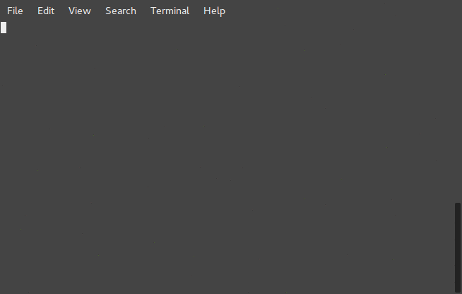

Traduit
=======


[](https://circleci.com/gh/jdrouet/traduit)
[](https://codecov.io/gh/jdrouet/traduit)


A magic tool to add translation to you translation file

Installation
------------

```bash
npm install -g traduit
```

Adding a key to your translations
---------------------------------

```bash
traduit /the/path/to/my/translations/*
```


Deleting a key to your translations
-----------------------------------

```bash
traduit -d /the/path/to/my/translations/*
```



